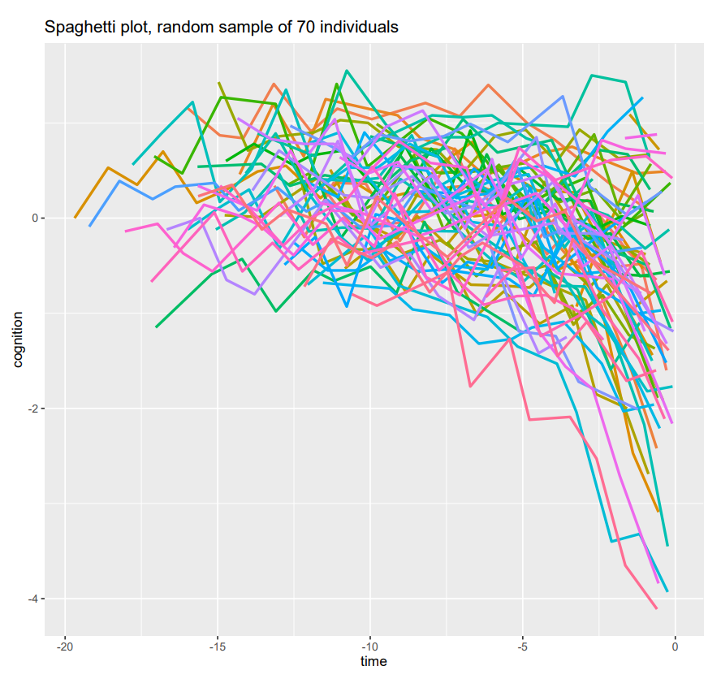
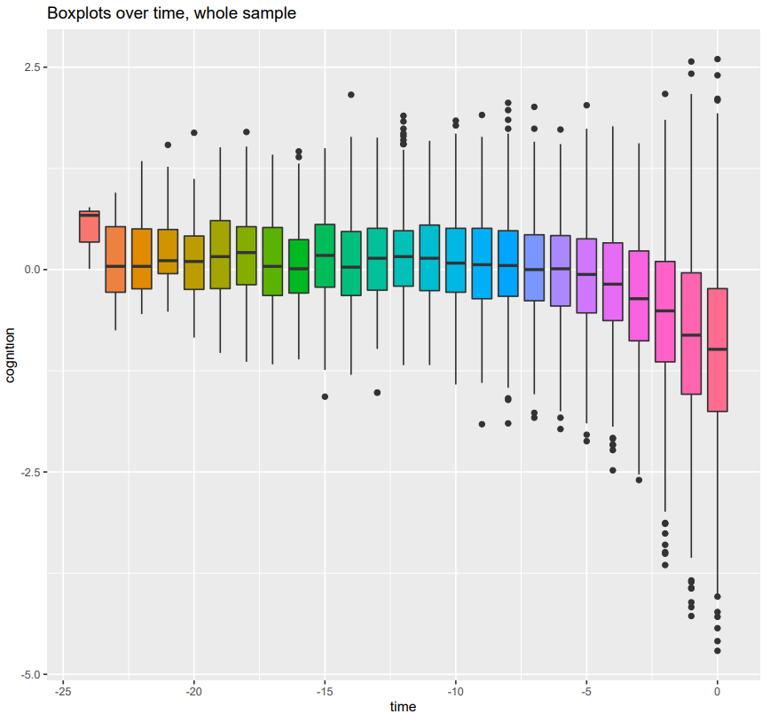
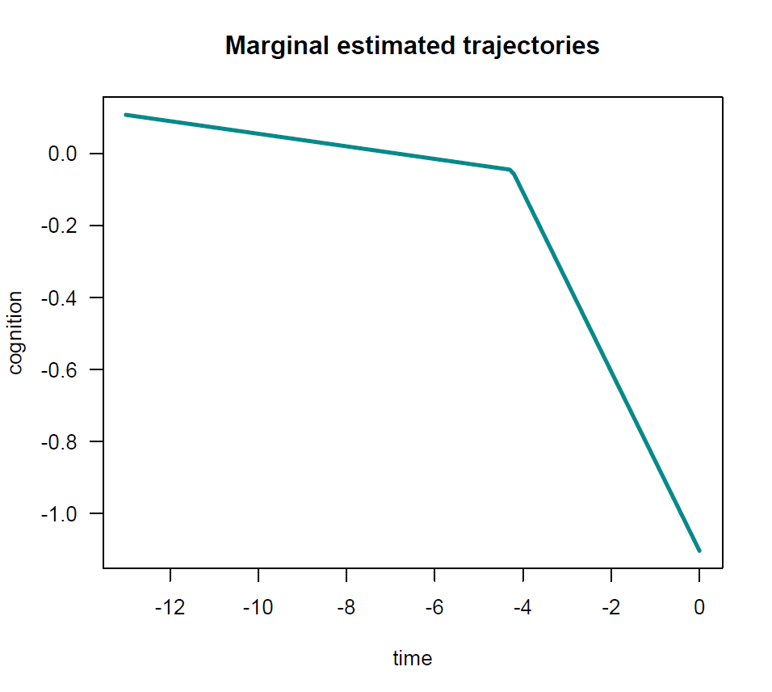
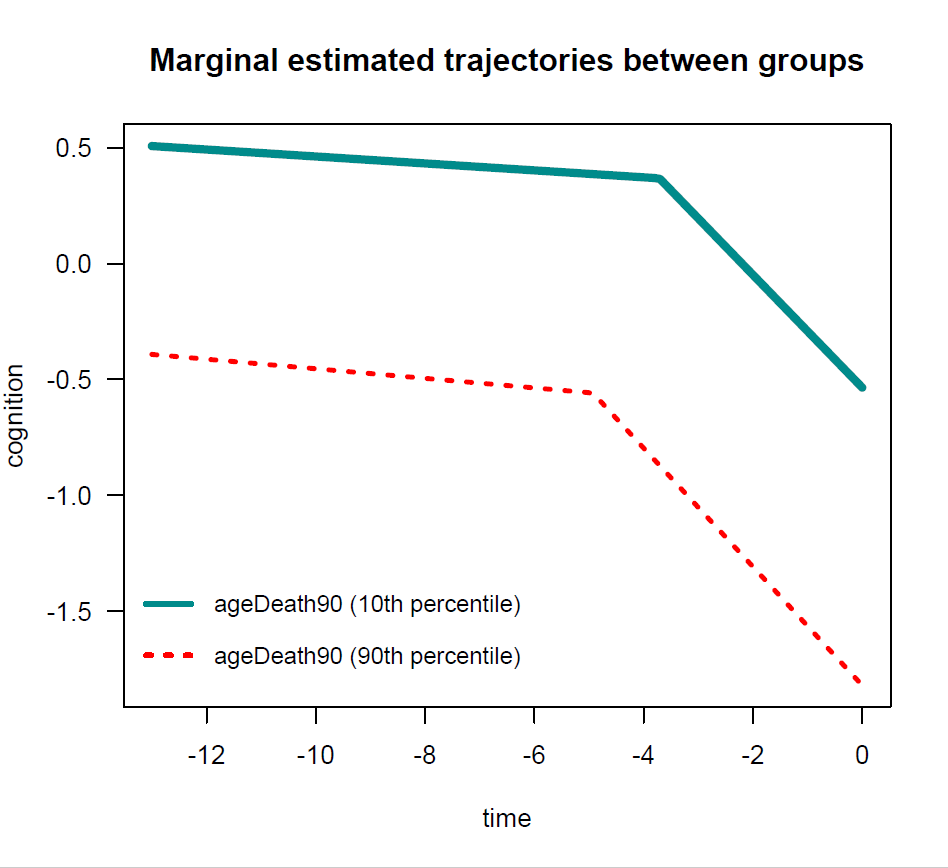
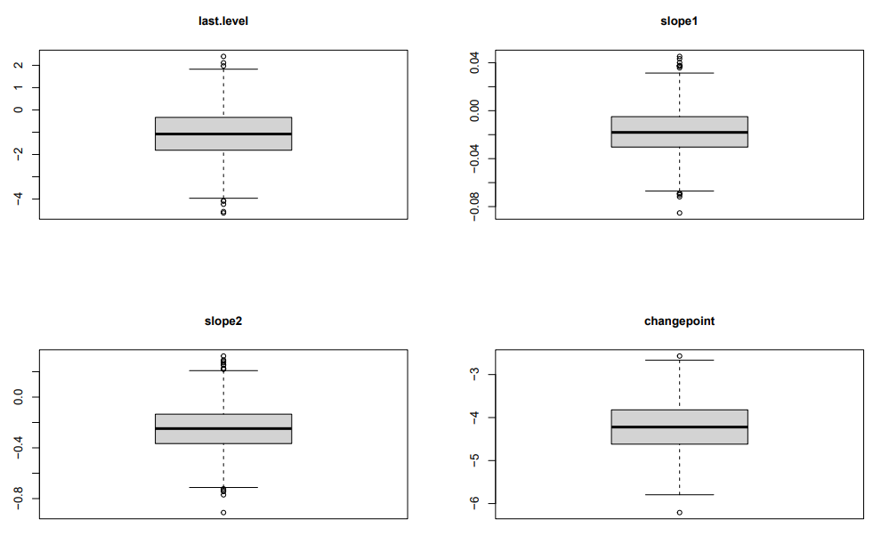

nlive (version 0.5.0)
------------
The nlive R package allows to fit a Sigmoidal Mixed Model with 4 parameters, a Piecewise Linear Mixed Model 
with abrupt change, or a Piecewise Linear Mixed Model with a smooth polynomial transition in the context of
longitudinal Gaussian outcomes. This function was designed to be
intuitive enough to the less sophisticated users, while using recent developments such as the
stochastic approximation expectation-maximization (SAEM) algorithm for efficient estimation. It was
designed to optimize the initial values of the main parameters and help
interpretation of the output by providing different features such as annotated outputs and graphs.

## INSTALLING 
Install the CRAN version with: 
``` r
install.packages("nlive")
```

Install the most recent update version from Github with:
``` r
library(remotes)
library(ggplot2)
library(dplyr)
library(lcmm)
library(sitar)
library(Rmisc)
library(graphics)
library(saemix)
library(stats)
library(sqldf)
library(nlraa)
library(janitor)
library(fastDummies)
remotes::install_github("MaudeWagner/nlive")
```

## DOCUMENTATION

A detailed companion paper, including illustrative examples, is available in BMC Medical Research Methodology:

Capuano AW, Wagner M. nlive: an R package to facilitate the application of the sigmoidal and random changepoint mixed models. BMC Med Res Methodol. 2023;23(1):257. https://doi.org/10.1186/s12874-023-02075-4

## ISSUES

Issues and questions about the use of the nlive R package can be reported on https://github.com/MaudeWagner/nlive/issues. When reporting a bug, please provide a reproducible example.

## ILLUSTRATIVE EXAMPLE: Piecewise linear mixed model with abrupt change


### Data

The dataset `dataCog` (automatically loaded with the package) contains 1200 individuals with one line per visit. On each line, we can read `ID` the participant identifier, `time` the negative retrospective time before death (in years), `cognition` the repeated measures of global cognition collected during the follow-up, and `ageDeath` the age at death of individuals (in years). For interpretation purposes, `ageDeath` was centered at its mean (`ageDeath90`). The following lines display the first lines of `dataCog`: 

    head(dataCog)
    
    ##    ID   time cognition ageDeath ageDeath90 
    ##  1000 -10.00      0.45       91          1
    ##  1000  -9.08      0.27       91          1
    ##  1000  -8.04      0.19       91          1
    ##  1000  -6.82      0.15       91          1
    ##  1000  -5.99      0.05       91          1
    ##  1000  -4.98      0.15       91          1

### Inspection of the data

Before fitting a model, the user can inspect the longitudinal outcome of interest `cognition` using the function `nlive.inspect()`:
``` r
nlive.inspect(dataset=dataCog, ID="ID", variable="cognition", time="time")
``` 
Key plots are generated, including the distribution of the longitudinal `cognition`, a spaghetti plot of the observed individual `cognition` trajectories before death for 70 individuals randomly selected in `dataCog`, and boxplots of the longitudinal observed `cognition` measures, obtained every year before death, for the whole population.






### Specification of PMM-abrupt
``` r
pmm.abrupt.fit = nlive.pmma(dataset=dataCog, ID="ID", outcome="cognition", time="time", var.all=c("ageDeath90"), traj.marg=TRUE, traj.marg.group=c("ageDeath90"))
``` 

### General outputs 

#### (i) Summary of the estimates
    ## ...      
    ## ----------------------------------------------------
    ## -----------  Variance of random effects  -----------
    ## ----------------------------------------------------
    ##             Parameter          Estimate SE      CV(%)
    ## last.level  omega2.last.level  1.07196  4.7e-02  4.4 
    ## slope1      omega2.slope1      0.00062  7.4e-05 11.9 
    ## slope2      omega2.slope2      0.03830  2.0e-03  5.2 
    ## changepoint omega2.changepoint 0.58980  7.9e-02 13.4 
    ## covar       cov.slope1.slope2  0.00378  3.2e-04  8.4 
    ## ----------------------------------------------------
    ## ------  Correlation matrix of random effects  ------
    ## ----------------------------------------------------
    ##                    omega2.last.level omega2.slope1 omega2.slope2
    ## omega2.last.level  1                 0.00          0.00         
    ## omega2.slope1      0                 1.00          0.78         
    ## omega2.slope2      0                 0.78          1.00         
    ## omega2.changepoint 0                 0.00          0.00         
    ##                    omega2.changepoint
    ## omega2.last.level  0                 
    ## omega2.slope1      0                 
    ## omega2.slope2      0                 
    ## omega2.changepoint 1                 
    ## ----------------------------------------------------
    ## ---------------  Statistical criteria  -------------
    ## ----------------------------------------------------
    ## Likelihood computed by linearisation
    ##       -2LL= 12349.9 
    ##       AIC = 12377.9 
    ##       BIC = 12449.16 
    ## 
    ## Likelihood computed by importance sampling
    ##       -2LL= 12296.83 
    ##       AIC = 12324.83 
    ##       BIC = 12396.1 
    ## ----------------------------------------------------
    ##                      Parameter Estimate     SE  p-value
    ## 1                   last.level   -1.103  0.031  P<.0001
    ## 2  beta_ageDeath90(last.level)   -0.062  0.004  P<.0001
    ## 3                       slope1   -0.017  0.002  P<.0001
    ## 4      beta_ageDeath90(slope1)  -0.0003 0.0004    0.082
    ## 5                       slope2   -0.249  0.007  P<.0001
    ## 6      beta_ageDeath90(slope2)   -0.001  0.001    0.159
    ## 7                  changepoint    -4.25  0.048  P<.0001
    ## 8 beta_ageDeath90(changepoint)   -0.059  0.006  P<.0001
    ## 9      residual standard error    0.281  0.002  P<.0001
    ## ----------------------------------------------------
    ##  The program took 168.58 seconds 


#### (ii) Plot of marginal estimated trajectories

For the most common profile of covariates (`traj.marg=TRUE`) - that is here participants aged 90 years at death (`var.all=ageDeath90`).

 

According to age at death (`traj.marg.group=c("ageDeath90")`) - values at the 10th vs. 90th percentiles are considered by default.

 

### Extract subject-specific predictions 
``` r
head(psi(pmm.abrupt.fit, type="mean"))
``` 
    ##            [,1]         [,2]       [,3]      [,4]
    ## [1,] -0.4407346 -0.010094826 -0.1829749 -3.795890
    ## [2,] -1.0962085 -0.021387023 -0.2702190 -4.402796
    ## [3,] -1.4489273 -0.011734242 -0.1828391 -4.222868
    ## [4,] -2.3125194 -0.037893158 -0.4280412 -4.191715
    ## [5,] -1.4742977 -0.026969207 -0.3554523 -3.960455
    ## [6,] -0.3757513 -0.008739808 -0.1729773 -3.857671

### Extract random effects 
``` r
head(eta(pmm.abrupt.fit, type="mean"))
```
    ##             [,1]         [,2]         [,3]        [,4]
    ## [1,]  0.56429219  0.007543470  0.011370603  0.88655030
    ## [2,]  0.03368492  0.001122928  0.036148300 -0.92399512
    ## [3,] -0.55159983  0.028859466  0.007349072 -0.22031669
    ## [4,] -1.30823969 -0.022026587 -0.172103574 -0.06386854
    ## [5,] -0.53423330 -0.007728255 -0.115472760  0.11876845
    ## [6,]  0.53464877  0.001995156  0.058633033 -0.25910762
    
### Boxplots of the random effects 
``` r
saemix.plot.randeff(pmm.abrupt.fit)
``` 
 

